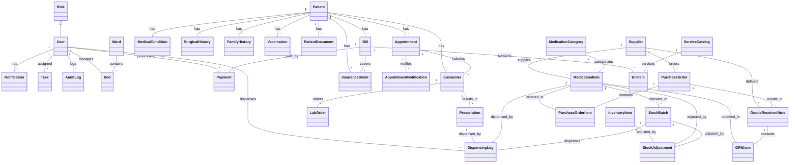

# Chelal Hospital Management System Backend

## Summary

Chelal HMS is a comprehensive Django REST backend for hospital management, including:

- Patient registration, appointments, encounters, prescriptions
- Pharmacy inventory, procurement, dispensing, and reporting
- Billing, insurance, payments
- Bed/ward management
- Audit logs, notifications, dashboards
- Appointment reminders/follow-ups (SMS & email)
- Role-based access, 2FA, and more

---

## Features

- Advanced pharmacy inventory (batch, FEFO, supplier, reporting)
- Billing & insurance (service catalog, bills, payments, insurance)
- Role-specific dashboards
- Audit logs, session management, 2FA
- Bed/ward management
- Appointment reminders & follow-ups (SMS/Email)
- Telemedicine-ready (WebSocket, video-ready)
- Feedback endpoints
- Full admin and API documentation

---

## Data Model (All Models)

See the Mermaid class diagram below for relationships. All models are in `core/models.py`.

### Main Models

- **Role**: User roles (Doctor, Receptionist, Admin, etc.)
- **User**: Custom user with role
- **Patient**: Patient demographics and info
- **Appointment**: Scheduling, status, patient, doctor
- **Encounter**: Clinical encounter, notes, diagnosis
- **Prescription**: Linked to encounter, medication, dosage
- **InventoryItem**: Simple inventory (legacy)
- **Vitals**: Vitals for an encounter
- **MedicalCondition**: Patient chronic conditions
- **SurgicalHistory**: Patient surgical history
- **FamilyHistory**: Family medical history
- **Vaccination**: Vaccination records
- **LabOrder**: Lab test orders/results
- **PatientDocument**: Uploaded files for patient
- **Notification**: User notifications
- **NoteTemplate**: Note templates for clinicians
- **Task**: Tasks for users
- **AuditLog**: Security and audit trail
- **Ward**: Hospital wards
- **Bed**: Beds in wards
- **Supplier**: Pharmacy supplier
- **MedicationCategory**: Pharmacy medication category
- **MedicationItem**: Pharmacy medication master
- **StockBatch**: Pharmacy batch tracking
- **PurchaseOrder**: Pharmacy procurement
- **PurchaseOrderItem**: Items in a purchase order
- **GoodsReceivedNote**: Goods received from supplier
- **GRNItem**: Items in a GRN
- **DispensingLog**: Medication dispensing
- **StockAdjustment**: Inventory adjustments
- **ServiceCatalog**: Billable services
- **InsuranceDetail**: Patient insurance
- **Bill**: Patient bill
- **BillItem**: Line items in a bill
- **Payment**: Payments for bills
- **AppointmentNotification**: Reminders/follow-ups (SMS/email)
- **SecureMessage**: Secure patient-provider messages

---

## Class Diagram



---

## Use Case Diagram (Textual)

- **Receptionist**: Register patient, schedule appointment, manage queue, assign beds
- **Doctor**: View dashboard, see appointments, record encounter, prescribe, order labs
- **Pharmacist**: Manage inventory, dispense, receive stock, report
- **Admin**: Manage users, audit logs, sessions, dashboards, all data
- **Patient**: Receive reminders, follow-ups, feedback

---

## Sequence Diagram: Appointment Reminder (SMS/Email)


---

## API Endpoints & Usage Examples

### Authentication

- `POST /api/auth/` — Obtain JWT token
- `POST /api/auth/refresh/` — Refresh JWT token

### Patients

- `GET /api/patients/` — List patients
- `POST /api/patients/` — Create patient
- `GET /api/patients/{id}/` — Retrieve patient
- `PUT/PATCH /api/patients/{id}/` — Update patient
- `DELETE /api/patients/{id}/` — Delete patient

#### Example: Create a Patient

```http
POST /api/patients/
{
  "unique_id": "P12345",
  "first_name": "Jane",
  "last_name": "Doe",
  "date_of_birth": "1990-01-01",
  "gender": "Female",
  "contact_info": "+2207834351",
  "address": "Banjul",
  "known_allergies": "Penicillin"
}
```

### Appointments

- `GET /api/appointments/` — List appointments (filter by patient, doctor, date)
- `POST /api/appointments/` — Create appointment
- `GET /api/appointments/{id}/` — Retrieve appointment
- `PUT/PATCH /api/appointments/{id}/` — Update appointment
- `DELETE /api/appointments/{id}/` — Delete appointment

#### Example: Schedule an Appointment

```http
POST /api/appointments/
{
  "patient": 1,
  "doctor": 2,
  "date": "2025-05-27",
  "time": "10:00:00"
}
```

### Appointment Reminders & Follow-ups

- Automated via Celery (see below)
- Manual trigger:

```bash
python manage.py send_appointment_reminders --hours 24
```

### Billing

- `POST /api/bills/` — Create bill
- `POST /api/payments/` — Post payment

#### Example: Bill a Patient

```http
POST /api/bills/
{
  "patient": 1,
  "encounter": 5,
  "total_amount": 500.00,
  "insurance": 2
}
```

### Pharmacy

- `POST /api/stock-adjustments/` — Record stock adjustment

#### Example: Pharmacy Stock Adjustment

```http
POST /api/stock-adjustments/
{
  "medication_item": 3,
  "stock_batch": 7,
  "adjustment_type": "Damaged",
  "quantity": -10,
  "reason": "Broken packaging",
  "adjusted_by": 2
}
```

### Appointment Notification Status

- `GET /api/appointment-notifications/{id}/status/` — Get the status of a specific appointment notification

#### Example:

```http
GET /api/appointment-notifications/42/status/
```
Response:
```json
{
  "id": 42,
  "appointment_id": 17,
  "notification_type": "reminder",
  "channel": "sms",
  "status": "sent",
  "scheduled_for": "2025-05-27T09:00:00Z",
  "sent_at": "2025-05-27T09:01:00Z",
  "error_message": ""
}
```

### Telemedicine

- `POST /api/telemedicine/sessions/` — Create a scheduled video session (linked to an appointment)
- `GET /api/telemedicine/sessions/{id}/join_info/` — Get join URLs/tokens for doctor/patient
- `POST /api/telemedicine/sessions/{id}/end/` — Log session end

#### Example: Create a Telemedicine Session

```http
POST /api/telemedicine/sessions/
{
  "appointment": 1,
  "scheduled_start": "2025-05-27T10:00:00Z"
}
```

#### Example: Get Join Info

```http
GET /api/telemedicine/sessions/5/join_info/
```
Response:
```json
{
  "join_url_doctor": "https://video.example.com/room/abc?role=doctor",
  "join_url_patient": "https://video.example.com/room/abc?role=patient",
  "video_room_id": "abc"
}
```

#### Example: End a Session

```http
POST /api/telemedicine/sessions/5/end/
```
Response:
```json
{
  "status": "ended",
  "ended_at": "2025-05-27T11:00:00Z"
}
```

### Referrals

- `POST /api/referrals/` — Create a referral
- `GET /api/referrals/` — List all referrals
- `GET /api/referrals/{id}/` — Retrieve a referral
- `PUT/PATCH /api/referrals/{id}/` — Update a referral
- `DELETE /api/referrals/{id}/` — Delete a referral

#### Example: Create a Referral

```http
POST /api/referrals/
{
  "patient": 1,
  "referring_doctor_details": "Dr. Smith (ID: 2)",
  "referred_to_doctor_details": "Dr. Jones (ID: 3)",
  "reason_for_referral": "Specialist evaluation for chronic headache",
  "status": "Pending"
}
```

### Resource Scheduling

- `POST /api/resources/` — Create a schedulable resource (e.g., operating room, equipment)
- `GET /api/resources/` — List all resources
- `POST /api/resource-bookings/` — Book a resource
- `GET /api/resource-bookings/` — List all bookings

#### Example: Book a Resource

```http
POST /api/resource-bookings/
{
  "resource": 1,
  "booked_by": 2,
  "patient": 1,
  "start_time": "2025-05-27T14:00:00Z",
  "end_time": "2025-05-27T16:00:00Z",
  "purpose": "Surgery"
}
```

### Patient Portal (API-driven)

- `GET /api/patients/{id}/appointments/` — Patient views their appointments
- `GET /api/patients/{id}/laborders/` — Patient views their lab results (after review)
- `GET /api/patients/{id}/prescriptions/` — Patient views their medication list
- `GET /api/patients/{id}/bills/` — Patient views their bills
- `PATCH /api/patients/{id}/` — Patient updates limited demographic info
- `POST /api/patients/{id}/messages/` — Patient sends a secure message to care team (future)

### Clinical Decision Support Hooks

- Abnormal lab results: When a lab result is critically abnormal, the system flags it and/or creates a high-priority task for the doctor.
- Guideline reminders: System can create reminders for guideline-based care (e.g., "Patient X is due for Y screening").

---

## Environment & Configuration

### .env Example

```env
# Twilio credentials
TWILIO_ACCOUNT_SID=your_twilio_sid
TWILIO_AUTH_TOKEN=your_twilio_token
TWILIO_PHONE_NUMBER=your_twilio_number

# SendGrid (preferred) or SMTP credentials
SENDGRID_API_KEY=your_sendgrid_api_key
DEFAULT_FROM_EMAIL=your_verified_sendgrid_sender
# (If not using SendGrid, set EMAIL_HOST, EMAIL_PORT, EMAIL_HOST_USER, EMAIL_HOST_PASSWORD)

# Celery/Redis
CELERY_BROKER_URL=redis://localhost:6379/0
CELERY_RESULT_BACKEND=redis://localhost:6379/0

# Test patient info (for automated test script)
TEST_PATIENT_PHONE=+2207834351
TEST_PATIENT_EMAIL=esjallow03@gmail.com
```

---

## Running the System

1. Create and activate a virtual environment:

   ```bash
   python3 -m venv venv
   source venv/bin/activate
   ```

2. Install dependencies:

   ```bash
   pip install -r requirements.txt
   ```

3. Configure your `.env` file with all credentials.

4. Run migrations:

   ```bash
   python manage.py migrate
   ```

5. Create a superuser:

   ```bash
   python manage.py createsuperuser
   ```

6. Start the development server:

   ```bash
   python manage.py runserver
   ```

7. Start Redis server (for Celery):

   ```bash
   redis-server
   ```

8. Start Celery worker:

   ```bash
   celery -A Backend worker --loglevel=info
   ```

9. Start Celery beat (for periodic tasks):

   ```bash
   celery -A Backend beat --loglevel=info
   ```

---

## Docker Usage

A `Dockerfile` and `docker-compose.yml` are provided for containerized deployment.

### Build and Run with Docker Compose

```bash
docker-compose up --build
```

- The backend will be available at `http://localhost:8000/`
- The PostgreSQL database will be available at `localhost:5432` (internal to Docker network as `db:5432`)

### Stopping and Removing Containers

```bash
docker-compose down
```

### Running Migrations in Docker

```bash
docker-compose run web python manage.py migrate
```

### Creating a Superuser in Docker

```bash
docker-compose run web python manage.py createsuperuser
```

---

## Automated Test Script

- File: `core/test_notifications_tasks_templates.py`

**Usage:**

1. Fill in your `.env` with real credentials and test patient info.
2. Export env vars:

   ```bash
   export $(grep -v '^#' .env | xargs)
   ```

3. Run:

   ```bash
   python core/test_notifications_tasks_templates.py
   ```

4. Check your phone, email, and the `AppointmentNotification` table for results.

---

## Future Enhancements & Roadmap

- **Telemedicine:** Real-time video session scheduling and secure chat.
- **Offline Sync:** Admin conflict resolution and queue monitoring.
- **Internationalization:** User language preference and locale-aware formatting.
- **Compliance:** Data encryption at rest, consent management, health check endpoints.
- **API Versioning:** `/api/v1/`, `/api/v2/` for backward compatibility.
- **Clinical Decision Support:** Hooks for abnormal lab result alerts and guideline reminders.
- **Referral Management:** Track patient referrals between providers.
- **Patient Portal:** Secure patient access to appointments, results, and bills.
- **Resource Scheduling:** Manage operating rooms and equipment bookings.
- **Advanced Reporting:** Financial, clinical, and operational analytics.

---

## Compliance & Security Considerations

- **Data Encryption at Rest:** Ensure sensitive patient data is encrypted in the database.
- **Granular Access Controls:** Enforce minimum necessary access to PHI/PII.
- **Breach Notification:** Prepare for regulatory breach notification requirements.
- **Consent Management:** Track patient consent for data processing and treatment.
- **Audit Logging:** Maintain detailed logs for all access and changes to sensitive data.

---

## License

MIT

---

## Financial Reporting

- `GET /api/financial-reports/receivables_aging/` — Accounts receivable aging buckets
- `GET /api/financial-reports/revenue_by_doctor/` — Revenue grouped by doctor
- `GET /api/financial-reports/revenue_by_service/` — Revenue grouped by service
- `GET /api/financial-reports/payer_mix/` — Revenue by payer type (insurance vs. self-pay)

#### Example: Receivables Aging

```http
GET /api/financial-reports/receivables_aging/
```
Response:
```json
{
  "0-30": 1200.0,
  "31-60": 800.0,
  "61-90": 500.0,
  "90+": 200.0
}
```

#### Example: Revenue by Doctor

```http
GET /api/financial-reports/revenue_by_doctor/
```
Response:
```json
[
  {"doctor_name": "Dr. Smith", "total": 5000.0},
  {"doctor_name": "Dr. Jones", "total": 3200.0}
]
```