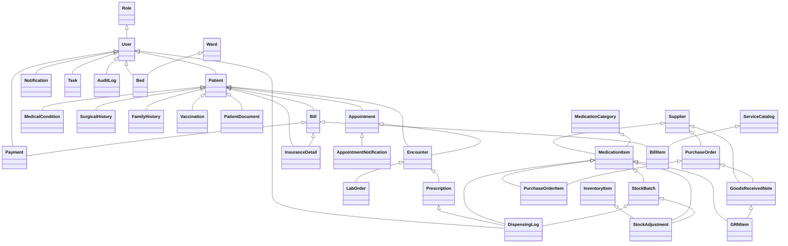

# Chelal HMS Data Model Overview

## Main Models

- **Role**: User roles (Doctor, Receptionist, Admin, etc.)
- **User**: Custom user with role
- **Patient**: Patient demographics and info
- **Appointment**: Scheduling, status, patient, doctor
- **Encounter**: Clinical encounter, notes, diagnosis
- **Prescription**: Linked to encounter, medication, dosage
- **InventoryItem**: Simple inventory (legacy)
- **Vitals**: Vitals for an encounter
- **MedicalCondition**: Patient chronic conditions
- **SurgicalHistory**: Patient surgical history
- **FamilyHistory**: Family medical history
- **Vaccination**: Vaccination records
- **LabOrder**: Lab test orders/results
- **LabTestCatalog**: Catalog of available lab tests
- **LabOrderItem**: Individual test item within a lab order
- **LabResultValue**: Specific result value for a lab order item
- **PatientDocument**: Uploaded files for patient
- **Notification**: User notifications
- **NoteTemplate**: Note templates for clinicians
- **Task**: Tasks for users
- **AuditLog**: Security and audit trail
- **Ward**: Hospital wards
- **Bed**: Beds in wards
- **Supplier**: Pharmacy supplier
- **MedicationCategory**: Pharmacy medication category
- **MedicationItem**: Pharmacy medication master
- **StockBatch**: Pharmacy batch tracking
- **PurchaseOrder**: Pharmacy procurement
- **PurchaseOrderItem**: Items in a purchase order
- **GoodsReceivedNote**: Goods received from supplier
- **GRNItem**: Items in a GRN
- **DispensingLog**: Medication dispensing
- **StockAdjustment**: Inventory adjustments
- **ServiceCatalog**: Billable services
- **InsuranceDetail**: Patient insurance
- **Bill**: Patient bill
- **BillItem**: Line items in a bill
- **Payment**: Payments for bills
- **AppointmentNotification**: Reminders/follow-ups (SMS/email)

---

## Mermaid Class Diagram (Core Relationships)



---

## Example API Usage

### Create a Patient

```http
POST /api/patients/
{
  "unique_id": "P12345",
  "first_name": "Jane",
  "last_name": "Doe",
  "date_of_birth": "1990-01-01",
  "gender": "Female",
  "contact_info": "+2207834351",
  "address": "Banjul",
  "known_allergies": "Penicillin"
}
```

### Schedule an Appointment

```http
POST /api/appointments/
{
  "patient": 1,
  "doctor": 2,
  "date": "2025-05-27",
  "time": "10:00:00"
}
```

### Trigger Manual Reminder

```bash
python manage.py send_appointment_reminders --hours 24
```

### Example: Bill a Patient

```http
POST /api/bills/
{
  "patient": 1,
  "encounter": 5,
  "total_amount": 500.00,
  "insurance": 2
}
```

### Example: Pharmacy Stock Adjustment

```http
POST /api/stock-adjustments/
{
  "medication_item": 3,
  "stock_batch": 7,
  "adjustment_type": "Damaged",
  "quantity": -10,
  "reason": "Broken packaging",
  "adjusted_by": 2
}
```

### Example: Create a Lab Order

```http
POST /api/lab_orders/
{
  "encounter": 1,
  "order_date": "2025-05-26",
  "status": "Ordered"
}
```

### Example: Add Items to a Lab Order

```http
POST /api/lab_orders/{order_id}/add_items/
{
  "items": [
    {
      "lab_test_id": 1, // ID of LabTestCatalog entry
      "notes_for_lab": "Fasting required"
    },
    {
      "lab_test_id": 2,
      "notes_for_lab": ""
    }
  ]
}
```

### Example: Add Results to Lab Order Items

```http
PUT /api/lab_orders/{order_id}/add_results/
{
  "results": [
    {
      "lab_order_item": 1, // ID of LabOrderItem
      "parameter_name": "White Blood Cell Count",
      "value_numeric": 7.5,
      "units": "x10^9/L",
      "reference_range_low": 4.0,
      "reference_range_high": 11.0,
      "abnormal_flag": "normal"
    },
    {
      "lab_order_item": 2,
      "parameter_name": "Hemoglobin",
      "value_numeric": 14.2,
      "units": "g/dL",
      "reference_range_low": 13.5,
      "reference_range_high": 17.5,
      "abnormal_flag": "normal"
    }
  ]
}
```

### Example: Retrieve Patient Lab History

```http
GET /api/patients/{patient_id}/lab_history/
```

---

For more, see the main README and API docs.
